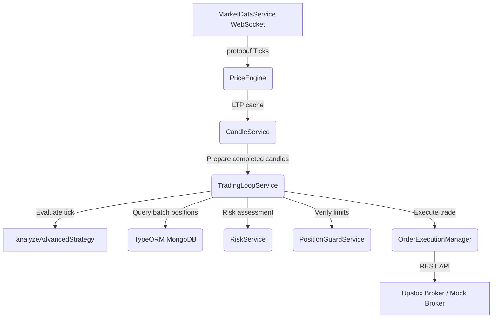

# Algorithmic Trading Bot System Architecture

This document details the production-hardened institutional system architecture.

## Core Modules & Design Patterns

### 1. Decoupled Tick Ingestion
* **MarketDataService:** Establishes connection to the Upstox Protobuf WebSocket feed and streams raw tick bytes. It parses ticks into internal objects and fires events to decouple ingestion from execution.
* **PriceEngine:** Subscribes to tick updates, keeping price updates stored in-memory while checking tick ages for stale feed alarms.

### 2. Parity-Aligned Execution Loop
* **TradingLoopService:** Runs on periodic intervals to trigger strategy evaluations.
* **prepareStrategyCandles:** Formulates completed candles without look-ahead bias, slicing out any live or partial candle boundaries at simulated tick or live clock boundaries.
* **Centralized Stop-Loss Audit:** Trailing stops are calculated using a unified static checker in `RiskService`, preventing math drift between order execution, position validation, and automatic repairs.

### 3. Hardened Security & Rate Limiting
* **JWT Enforcements:** Strict length validation on startup forces a minimum 256-bit strength (32 characters).
* **Bounded FIFO Rate Limiter:** Protects Express endpoints using a memory-capped TTL cache that prevents memory footprint leaks.

### 4. Scheduled Observability & Analytics
* **AuditScheduler:** Coordinates timezone-aligned cron events to capture daily trading audits, weekly reviews, and monthly compliance metrics.
* **SystemHealthMonitor:** Continuous logging of memory usage, event loops, database ping times, and order latencies.
